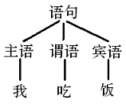
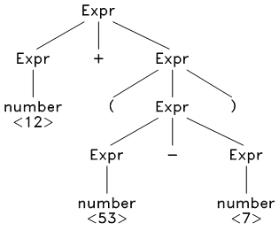
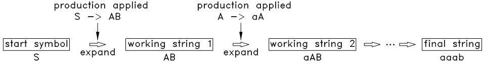
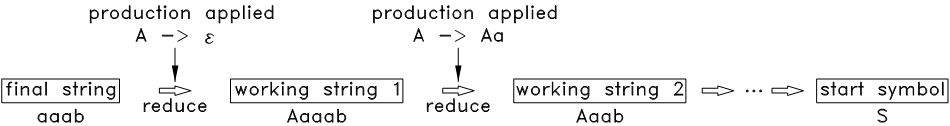

# MiniC
First TinyC, then MiniC

# Table of Contents
- [Progress](#progress)
- [环境配置](#环境配置)
- [ch2 TinyC Specification](#ch2-tinyc-specification)
- [ch4](#ch4)
- [ch5](#ch5)
- [ch7](#ch7)
- [ch8 用 flex 做词法分析](#ch8-用-flex-做词法分析)
  - [flex简介](#flex简介)
  - [使用 flex 对 TinyC 源文件进行词法分析](#使用-flex-对-tinyc-源文件进行词法分析)
- [ch9 上下文无关语法及分析](#ch9-上下文无关语法及分析)
  - [上下文无关语法](#上下文无关语法)
  - [分析树和抽象语法树](#分析树和抽象语法树)
  - [分析方法简介](#分析方法简介)
- [ch10 自顶向下的分析](#ch10-自顶向下的分析)
  - [LL(1)分析法的基本流程](#ll1分析法的基本流程)
  - [首字符集合（first set）和后继字符集合（follow set）](#首字符集合first-set和后继字符集合follow-set)
  - [LL(1) 动作表及 LL(1) 解析](#ll1-动作表及-ll1-解析)
  - [LL(1) 语法的特性](#ll1-语法的特性)
  - [LL(1) 分析法的优缺点](#ll1-分析法的优缺点)

## Progress
- [x] ch1-8
- [ ] ch9-16

## 环境配置
Platform: Ubuntu 22.04

如果您的系统中没有 gcc ，则应先安装 gcc 。如果你使用的是 debian ，可以用 apt-get 命令来安装，如下：
```shell
$ sudo apt-get install build-essential
```
## ch2 TinyC Specification
TinyC 是 C 语言中非常小的子集，所有 C 语法的规则均适用于 TinyC 语法， TinyC 源程序可直接用 gcc 编译
```shell
$ gcc -o tinyc tinyc.c
$ ./tinyc
```
## ch4
```shell
$ python3 pysim.py pcode_1.asm
$ python3 pysim.py pcode_1.asm -d
```
## ch5

```shell
$ python3 pysim.py factor.asm -a
$ python3 pysim.py factor.asm -da
```

## ch7
```shell
$ python3 scan.py
```

## ch8 用 flex 做词法分析
flex的作用是根据用户使用regex定义的分词匹配模式自动化构造一个lexer/scanner。C/C++使用flex，Java使用jflex。

### flex简介

#### flex的安装
```shell
$ sudo apt-get install flex
```
#### flex的测试
hide-digits.l：该文件的作用是不停从标准输入（键盘）中读入字符，将其中的数字串替换成 ? 后再输出到标准输出（终端），当遇到 # 后程序退出
```flex
%%
[0-9]+  printf("?");
#       return 0;
.       ECHO;
%%

int main(int argc, char* argv[]) {
    yylex();
    return 0;
}

int yywrap() { 
    return 1;
}
```
测试指令：用flex 会将这些正则表达式翻译成 C 代码格式的函数 yylex ，并输出到 lex.yy.c 文件中，该函数可以看成一个有限状态自动机
```shell
$ flex hide-digits.l
```
此时目录下多了一个 “lex.yy.c” 文件，把这个 C 文件编译并运行一遍。
```shell
$ gcc -o hide-digits lex.yy.c
$ ./hide-digits
```
然后在终端不停的敲入任意键并回车，可以发现，敲入的内容中，除数字外的字符都被原样的输出了，而每串数字字符都被替换成 ? 了。最后敲入 # 后程序退出了。如下：
```
eruiewdkfj
eruiewdkfj
1245
?
fdsaf4578
fdsaf?
...
#
```
##### 代码解释：hide-digits.l
hide-digits.l
```
%%
[0-9]+  printf("?");
#       return 0;
.       ECHO;
%%
```
flex 模式文件中，%% 和 %% 之间的内容被称为 规则（rules），本文件中每一行都是一条规则，每条规则由 匹配模式（pattern） 和 事件（action） 组成， 模式在前面，用正则表达式表示，事件在后面，即 C 代码。每当一个模式被匹配到时，后面的 C 代码被执行。

简单来说，flex 会将本段内容翻译成一个名为 yylex 的函数，该函数的作用就是扫描输入文件（默认情况下为标准输入），当扫描到一个完整的、最长的、可以和某条规则的正则表达式所匹配的字符串时，该函数会执行此规则后面的 C 代码。如果这些 C 代码中没有 return 语句，则执行完这些 C 代码后， yylex 函数会继续运行，开始下一轮的扫描和匹配。

当有多条规则的模式被匹配到时， yylex 会选择匹配长度最长的那条规则，如果有匹配长度相等的规则，则选择排在最前面的规则。

```
int main(int argc, char *argv[]) {
    yylex();
    return 0;
}

int yywrap() { return 1; }
```
第二段中的 main 函数是程序的入口， flex 会将这些代码原样的复制到 lex.yy.c 文件的最后面。最后一行的 yywrap 函数的作用后面再讲，总之就是 flex 要求有这么一个函数。

总结：因此，程序开始运行后，就开始执行 yylex 函数，然后开始扫描标准输入。当扫描出一串数字时，[0-9]+ 被匹配到，因此执行了 printf(”?”) ，当扫描到其他字符时，若不是 # ，则 . 被匹配，后面的 ECHO 被执行， ECHO 是 flex 提供的一个宏（#define），作用是将匹配到的字符串原样输出，当扫描到 # 后， # 被匹配， return 0 被执行， yylex 函数返回到 main 函数，之后程序结束。

##### 更复杂的代码解释：word-spliter.l
word-spliter.l：该程序是一个原始的分词器，它将输入文件分割成一个个的 WORD 再输出到终端，同时统计输入文件中的字符数、单词数和行数。此处的 WORD 指一串连续的非空格字符。

word-spliter 中只有 WORD 这一种类型的 token ，所有连续的非空格字符串都是一个 WORD ，它的正则表达式非常简单： [^ \t\n\r\a]+ 。 该程序中为 WORD 类型的 token 定义了一个值为 1 的编号： T_WORD ，每当扫描出一个完整的 WORD 时，就向 main 函数返回 T_WORD ，遇到文件结束则返回 0 。 main 函数则根据 yylex 函数的返回值进行不同的处理。

```
%{
#define T_WORD 1
int numChars = 0, numWords = 0, numLines = 0;
%}

WORD		([^ \t\n\r\a]+)

%%
\n			{ numLines++; numChars++; }
{WORD}		{ numWords++; numChars += yyleng; return T_WORD; }
<<EOF>>		{ return 0; }
.			{ numChars++; }
%%

int main() {
	int token_type;
	while (token_type = yylex()) {
		printf("WORD:\t%s\n", yytext);
	}
	printf("\nChars\tWords\tLines\n");
	printf("%d\t%d\t%d\n", numChars, numWords, numLines);
	return 0;
}

int yywrap() {
	return 1;
}
```
测试代码
```shell
$ flex word-spliter.l
$ gcc -o word-spliter lex.yy.c
$ ./word-spliter < word-spliter.l
```
输出结果
```
WORD:       %{
WORD:       #define
...
WORD:       }

Chars       Words   Lines
470 70      27
```
#### flex输入文件的格式详解
一个完整的flex输入文件的格式为：
```
%{
Declarations
%}
Definitions
%%
Rules
%%
User subroutines
```
 - 第一段：输入文件的第 1 段 %{ 和 %} 之间的为 声明（Declarations） ，都是 C 代码，这些代码会被原样的复制到 lex.yy.c 文件中，一般在这里声明一些全局变量和函数，这样在后面可以使用这些变量和函数。
 - 第二段：第 2 段 %} 和 %% 之间的为 定义（Definitions），在这里可以定义正则表达式中的一些名字，可以在 规则（Rules） 段被使用，如本文件中定义了 WORD 为 ([^ \t\n\r\a]+) ， 这样在后面可以用 {WORD} 代替这个正则表达式。
 - 第三段：第 3 段为 规则（Rules） 段，上一个例子中已经详细说明过了。
 - 第四段：第 4 段为 用户定义过程（User subroutines） 段，也都是 C 代码，本段内容会被原样复制到 yylex.c 文件的最末尾，一般在此定义第 1 段中声明的函数。

以上 4 段中，除了 Rules 段是必须要有的外，其他三个段都是可选的。

输入文件中最后一行的 yywrap 函数的作用是将多个输入文件打包成一个输入，当 yylex 函数读入到一个文件结束（EOF）时，它会向 yywrap 函数询问， yywrap 函数返回 1 的意思是告诉 yylex 函数后面没有其他输入文件了，此时 yylex 函数结束，yywrap 函数也可以打开下一个输入文件，再向 yylex 函数返回 0 ，告诉它后面还有别的输入文件，此时 yylex 函数会继续解析下一个输入文件。总之，由于我们不考虑连续解析多个文件，因此此处返回 1 。

和上一个例子不同的是，本例中的 action 中有 return 语句，而 main 函数内是一个 while 循环，只要 yylex 函数的返回值不为 0 ，则 yylex 函数将被继续调用，此时将从下一个字符开始新一轮的扫描。

另外，本例中使用到了 flex 提供的两个全局变量 yytext 和 yyleng，分别用来表示刚刚匹配到的字符串以及它的长度。

为方便编译，使用 makefile 进行编译及运行：

```makefile
run: word-spliter
	./word-spliter < word-spliter.l

word-spliter: lex.yy.c
	gcc -o $@ $<

lex.yy.c: word-spliter.l
	flex $<
```

将以上内容保存为 makefile ，和 word-spliter.l 文件放在当前目录，再在终端输入：
```shell
$ make
```
将输出和前面一样的内容。

### 使用 flex 对 TinyC 源文件进行词法分析

上一节的第二个例子 word-spliter 就是一个原始的分词器，在此例的框架上加以扩展就可以做为 TinyC 的词法分析器了。

word-spliter 中只有 WORD 这一种类型的 token ，所有连续的非空格字符串都是一个 WORD ，它的正则表达式非常简单： [^ \t\n\r\a]+ 。 该程序中为 WORD 类型的 token 定义了一个值为 1 的编号： T_WORD ，每当扫描出一个完整的 WORD 时，就向 main 函数返回 T_WORD ，遇到文件结束则返回 0 。 main 函数则根据 yylex 函数的返回值进行不同的处理。

word-spliter 中只有 WORD 这一种类型的 token ，所有连续的非空格字符串都是一个 WORD ，它的正则表达式非常简单： [^ \t\n\r\a]+ 。 该程序中为 WORD 类型的 token 定义了一个值为 1 的编号： T_WORD ，每当扫描出一个完整的 WORD 时，就向 main 函数返回 T_WORD ，遇到文件结束则返回 0 。 main 函数则根据 yylex 函数的返回值进行不同的处理。

从 word-spliter 程序的框架和流程中可以看出，词法分析器的扩展方法非常简单：
1. 列出 TinyC 中所有类型的 token；
2. 为每种类型的 token 分配一个唯一的编号，同时写出此 token 的正则表达式；
3. 写出每种 token 的 rule （相应的 pattern 和 action ）。

TinyC 中的 token 的种类非常少，按其词法特性，分为以下三大类。

 - 第 1 类为单字符运算符，一共 15 种：
```
+ * - / % = , ; ! < > ( ) { }
```
 - 第 2 类为双字符运算符和关键字，一共 16 种：
```
<=, >=, ==, !=, &&, ||
void, int, while, if, else, return, break, continue, print, readint
```
 - 第 3 类为整数常量、字符串常量和标识符（变量名和函数名），一共 3 种。

除第 3 类 token 的正则表达式稍微麻烦一点外，第 1 、 2 类 token 的正则表达式就是这些运算符或关键字的字面值。

token 的编号原则为：单字符运算符的 token 编号就是其字符的数值，其他类型的 token 则从 256 开始编号。

各类 token 的正则表达式及相应的 action 见下面的 scaner.l 文件，该文件的框架和上一节中的 word-spliter.l 是完全一样的，只不过 token 的类别多了。

scanner.l
```
%{
#include "token.h"
int cur_line_num = 1;
void init_scanner();
void lex_error(char* msg, int line);
%}

/* Definitions, note: \042 is '"' */
INTEGER             ([0-9]+)
UNTERM_STRING       (\042[^\042\n]*)
STRING              (\042[^\042\n]*\042)
IDENTIFIER          ([_a-zA-Z][_a-zA-Z0-9]*)
OPERATOR            ([+*-/%=,;!<>(){}])
SINGLE_COMMENT1     ("//"[^\n]*)
SINGLE_COMMENT2     ("#"[^\n]*)

%%

[\n]                { cur_line_num++;                       }
[ \t\r\a]+          { /* ignore all spaces */               }
{SINGLE_COMMENT1}   { /* skip for single line comment */    }
{SINGLE_COMMENT2}   { /* skip for single line commnet */    }

{OPERATOR}          { return yytext[0];         }   

"<="                { return T_Le;              }
">="                { return T_Ge;              }
"=="                { return T_Eq;              }
"!="                { return T_Ne;              }
"&&"                { return T_And;             }
"||"                { return T_Or;              }
"void"              { return T_Void;            }
"int"               { return T_Int;             }
"while"             { return T_While;           }
"if"                { return T_If;              }
"else"              { return T_Else;            }
"return"            { return T_Return;          }
"break"             { return T_Break;           }
"continue"          { return T_Continue;        }
"print"             { return T_Print;           }
"readint"           { return T_ReadInt;         }

{INTEGER}           { return T_IntConstant;     }
{STRING}            { return T_StringConstant;  }
{IDENTIFIER}        { return T_Identifier;      }

<<EOF>>             { return 0; }

{UNTERM_STRING}     { lex_error("Unterminated string constant", cur_line_num);  }
.                   { lex_error("Unrecognized character", cur_line_num);        }

%%

int main(int argc, char* argv[]) {
    int token;
    init_scanner();
    while (token = yylex()) {
        print_token(token);
        puts(yytext);
    }
    return 0;
}

void init_scanner() {
    printf("%-20s%s\n", "TOKEN-TYPE", "TOKEN-VALUE");
    printf("-------------------------------------------------\n");
}

void lex_error(char* msg, int line) {
    printf("\nError at line %-3d: %s\n\n", line, msg);
}

int yywrap(void) {
    return 1;
}
```

上面这个文件中，需要注意的是，正则表达式中，用双引号括起来的字符串就是原始字符串，里面的特殊字符是不需要转义的，而双引号本身必须转义（必须用 \” 或 \042 ），这是 flex 中不同于常规的正则表达式的一个特性。

除单字符运算符外的 token 的编号则在下面这个 token.h 文件，该文件中同时提供了一个 print_token 函数，可以根据 token 的编号打印其名称。
token.h
```
#ifndef TOKEN_H
#define TOKEN_H

typedef enum {
    T_Le = 256, T_Ge, T_Eq, T_Ne, T_And, T_Or, T_IntConstant,
    T_StringConstant, T_Identifier, T_Void, T_Int, T_While,
    T_If, T_Else, T_Return, T_Break, T_Continue, T_Print,
    T_ReadInt
} TokenType;

static void print_token(int token) {
    static char* token_strs[] = {
        "T_Le", "T_Ge", "T_Eq", "T_Ne", "T_And", "T_Or", "T_IntConstant",
        "T_StringConstant", "T_Identifier", "T_Void", "T_Int", "T_While",
        "T_If", "T_Else", "T_Return", "T_Break", "T_Continue", "T_Print",
        "T_ReadInt"
    };

    if (token < 256) {
        printf("%-20c", token);
    } else {
        printf("%-20s", token_strs[token-256]);
    }
}

#endif
```

下面来编译一下这两个文件， makefile 文件为：
```makefile
out: scanner

scanner: lex.yy.c token.h
	gcc -o $@ $<

lex.yy.c: scanner.l
	flex $<
```

将以上 3 个文件保存在终端的当前目录，再输入 make ，编译后生成了 scanner 文件。

下面来测试一下这个词法分析器，将 [samples.zip](https://pandolia.net/tinyc/downloads/samples1.zip) 文件下载并解压到 samples 目录，此文件包中有很多测试文件，我们先测试一下其中的一个文件，输入：

```shell
$ ./scanner < samples/sample_6_function.c > out.txt
```
再打开 out.txt 文件看看，可以看出 sample_6_function.c 文件的所有 token 都被解析出来了：

```
TOKEN-TYPE          TOKEN-VALUE
-------------------------------------------------
T_Int               int
T_Identifier        main
(                   (
)                   )
...
```

下面全部测试一下这些文件，在终端输入以下内容：

```shell
for src in $(ls samples/*.c); do ./scanner < $src > $src.lex; done
```

再在终端输入： bash test.sh 。之后，查看一下 samples 目录下新生成的 ”.lex” 文件。可以看出所有源文件都被解析完成了。

TinyC 语言中只有两类词法错误，一种是未结束的字符串，即只有前面一个双引号的字符串，另外一种就是非法字符，如 ~ @ 等（双引号内部的除外），scanner.l 文件中可以识别出这两种词法错误，同时定位出错误所在的行，详见该文件的 Rules 段的最后两条 Rule 。

## ch9 上下文无关语法及分析
上一节我们使用lexer生成器和编写的模式文件，借助flex生成了lexer，并使用lexer将原始代码处理并输出为token流。本节的语法分析的目的是将线性的token流转换成树状结构。

ch9将介绍：
 - 什么是语法
 - 如何用语法来描述语言
 - 语法分析的任务、基本方法和思路

### 上下文无关语法
给出定义，程序就是一个句子（字符串），语言就是句子的集合。那么如何准确表示这个集合？
 - 枚举法？no
 - 特征法？no
 - 正则表达式构造出的有限状态自动机？weak no
 - 上下文无关语法？yes

正则表达式毕竟太简单了，无法来表示程序语言这样复杂级别的句子集合。

为了表示程序语言的句子集合，需要采用表达能力更强大的工具 —— 上下文无关语法（context-free grammar） 。

#### 什么是上下文无关语法？
假设有一种非常非常原始的语言，我们把它成为 X 语言，它的句子只有： 主语 谓语 宾语 这样一种结构， 主语 中只有 我、 你、 他 三个词， 谓语 中只有 吃 一个词， 宾语 中只有 饭、菜 两个词。我们把它的语法写出下面这样的形式：
```
语句 -> 主语 谓语 宾语
主语 -> 我
主语 -> 你
主语 -> 他
谓语 -> 吃
宾语 -> 饭
宾语 -> 菜
```
可以看出， X 语言总共只有 6 个句子： { 我吃饭, 我吃菜, ..., 他吃菜 }。也就是说，我们可以用上面这个语法来表示 X 语言这个集合，我们可以从第一行的 “语句 -> 主语 谓语 宾语” 开始，分别将主、谓、宾替换成可用的词，从而将所有满足语法的句子都推导出来。对于任意一个句子，我们也可以将句子和此语法来对比，判断它是否属于满足 X 语言。

上面这个语法中的每一行形如 “语句 -> 主语 谓语 宾语” 的式子称为 产生式（production） 。

产生式左侧的符号（语句、主语、谓语和宾语）称为 非终结符（nonterminal） ，代表可以继续扩展或产生的符号，也就是说，当在某条产生式的右边遇到了此非终结符的时候，总是可以用本产生式的右边来替换这个非终结符。

而 “我、你、他、吃、饭、菜” 这些符号是 X 语言中的词，无法再产生新的符号了，称为 终结符（terminal） 。终结符只能出现在产生式的右边，非终结符则左边和右边都可以出现。

上述产生式中有一个特别的非终结符： “语句” ， X 语言中的所有句子都以它为起点产生，这个符号被称为 起始符号（start symbol）。

通常把同一个非终结符的产生式写在一起，用 “|” 隔开，如下：

```
语句 -> 主语 谓语 宾语
主语 -> 我 | 你 | 他
谓语 -> 吃
宾语 -> 饭 | 菜
```

注意，上面的第二行中有 3 个产生式，第四行中有 2 个产生式。

一个上下文无关语法 G 就是由一个终结符集合 T ，一个非终结符集合 N （ N 和 T 不相交），一个产生式集合 P ，以及一个起始符号 S （S ∈ N）组成。由语法 G 推导（产生）出来的所有的句子的集合称为 G 语言。因此一个语法可以代表一个句子集合，也就是一个语言。

终结符和非终结符统称为符号，符号一般用字母 A, B, X, Y, a, b 表示，符号串一般用小写字母 u, v 表示。产生式的形式为 A -> u ，其中 A 为非终结符， u 为一个符号串。

下面再来看一个例子：

```
S –> AB
A –> aA | ε
B –> b | bB
```
这里面的第二行中的 ε 表示一个空句子，表示 A 可以用一个空句子来代替。

经过观察可知，这个语法所能推导出的所有句子的集合为：

```
A : { ε, a, aa, aaa, ... }
B : { b, bb, bbb, ... }
S : { b, bb, bbb, ..., ab, abb, ..., aab, aabb, ... }
```

因此 S 相当于正则表达式 a*b+ 。

再来看一个稍微复杂的例子：

```
Expr -> Expr op Expr | (Expr) | number
op   -> + - * /
```

其中的 number 是词法分析得到的一个 token ，它在词法分析中用正则表达式 [0-9]+ 表示。

经过观察可知，此语法可以推导出所有的整数算术表达式：

```
Expr : { 123, 25 + 24, 78 - 34, 12 * ( 23 + 9 ), ... }
```

可以看出，上下文无关文法可以采用递归的形式推导，比正则表达式的表达能力要强大的多。

#### 上下文本无关语法及相关术语的正式定义

 - 终结符集合 T （terminal set） ： 一个有限集合，其元素称为 终结符（terminal） 。
 - 非终结符集合 N （non-terminal set) ： 一个有限集合，与 T 无公共元素，其元素称为 非终结符（non-terminal） 。
 - 符号集合 V （alphabet） ： T 和 N 的并集，其元素称为 符号（symbol） 。因此终结符和非终结符都是符号。符号可用字母：A, B, C, X, Y, Z, a, b, c 等表示。
 - 符号串（a string of symbols） ： 一串符号，如 X1 X2 ... Xn 。只有终结符的符号串称为 句子（sentence）。 空串 （不含任何符号）也是一个符号串，用 ε 表示。符号串一般用小写字母 u, v, w 表示。
 - 产生式（production） ： 一个描述符号串如何转换的规则。对于上下文本无关语法，其固定形式为： A -> u ，其中 A 为非终结符， u 为一个符号串。
 - 产生式集合 P （production set） ： 一个由有限个产生式组成的集合。
 - 展开（expand） ： 一个动作：将一个产生式 A -> u 应用到一个含有 A 的符号串 vAw 上，用 u 代替该符号串中的 A ，得到一个新的符号串 vuw 。
 - 折叠（reduce） ： 一个动作：将一个产生式 A -> u 应用到一个含有 u 的符号串 vuw 上，用 A 代替该符号串中的 u ，得到一个新的符号串 vAw 。
 - 起始符号 S （start symbol） ： N 中的一个特定的元素。
 - 推导（derivate） ： 一个过程：从一个符号串 u 开始，应用一系列的产生式，展开到另一个的符号串 v。若 v 可以由 u 推导得到，则可写成： u => v 。
 - 上下文本无关语法 G （context-free grammar, CFG） ： 一个 4 元组： (T, N, P, S) ，其中 T 为终结符集合， N 为非终结符集合， P 为产生式集合， S 为起始符号。一个句子如果能从语法 G 的 S 推导得到，可以直接称此句子由语法 G 推导得到，也可称此句子符合这个语法，或者说此句子属于 G 语言。 G 语言（ G language） 就是语法 G 推导出来的所有句子的集合，有时也用 G 代表这个集合。
 - 解析（parse） ： 也称为分析，是一个过程：给定一个句子 s 和语法 G ，判断 s 是否属于 G ，如果是，则找出从起始符号推导得到 s 的全过程。推导过程中的任何符号串（包括起始符号和最终的句子）都称为 中间句子（working string） 。

为什么要把这种语法称为上下文本无关语法呢？这是由其产生式的固定形式 A -> u 所决定的，事实上，还有所谓的上下文有关语法，其产生式的形式为 v A w -> v u w ，也就是说只有 A 的上下文分别为 v 和 w 时，才能应用该产生式。上下文本无关语法其实是上下文有关语法中的一种特例，也就是 v 和 w 分别为空串时的特例。

### 分析树和抽象语法树

语法分析不但要判断给定的句子是否符合语法结构，而且还要分析出该句子符合哪些结构。

也就是说，要分析出这个句子是怎么从起始符号开始产生出来的，并根据产生过程生成语法树。

如，对于 “我吃饭” 这句话，只有我们知道了 主语、谓语和宾语 分别对应的是那个词，我们才能真正理解这句话的含义。

 
<div style="text-align:center"> 
 
<p>图9.1 语法树示意图</p> 
</div>

以上一节表达式语法为例，给定一个句子 12 + 53 ，经过观察，发现此句子可以按以下方式被推导出来：

```
Expr ==> Expr + Expr ==> number + Expr ==> number + number ==> 12 + 53
```
以上推导过程可以用分析树来表示：

 
<div style="text-align:center"> 
 
<p>图9.2 分析树示意图a</p> 
</div>

再看一个稍微长的句子： 12 + ( 53 - 7 ) ，其分析树如下：

 
<div style="text-align:center"> 
 
<p>图9.3 分析树示意图b</p> 
</div>

可以去掉此分析树中一些多余的节点，并进一步浓缩，得到抽象语法树：

 
<div style="text-align:center"> 
 
<p>图9.4 抽象语法树示意图a</p> 
</div>

对于这种树状结构，可以采用递归的方式加以分析，从而生成目标代码。

再看一个句子： 12 + 53 * 7 ，这时候问题来了，我们发现它可以由两种不同的方式推导出来：

 
<div style="text-align:center"> 
 
<p>图9.5 抽象语法树示意图b</p> 
</div>

这就是语法的歧义性，所谓 歧义（ambiguity），就是指对于一个符合语法结构的句子，它可以由两种不同的方式被推导出来。如果一个语法中，任何一个句子的推导方式都是唯一的，那这个语法就被称为是 没有歧义 的。显然，程序语言必须是没有歧义的，对于上面的表达式，我们肯定希望它只能按后一种方式被推导。

消除歧义的方法之一是改写语法，将有歧义的产生式改写成无歧义的，这种改写非常困难，而且改写后的产生式往往和原产生式相差很大，可读性非常差。另一种方法就是引入 优先级 ，不需要改写语法，当推导过程中出现歧义的时候（也就是出现两种不同的推导方式的时候），利用符号的优先级来选择需要的推导方式，这种方法将在第 12 章中介绍。

### 分析方法简介

语法分析的任务：推导出指定的句子，或者说给定一个句子、要分析出它是怎么从起始符号开始推导得到的

#### 自顶向下分析

自顶向下分析就是从起始符号开始，不断的挑选出合适的产生式，将中间句子中的非终结符的展开，最终展开到给定的句子。

以上一节第二个语法为例：
```
S –> AB
A –> aA | ε
B –> b | bB
```

假设要分析的句子为： aaab 。

首先从起始符号 S 开始。

第 1 步，起始符号只有一个产生式： S -> AB ，所以只能选择这个产生式，用这个产生式的右边代替 S ，于是得到一个中间句子 AB ，将选择的产生式和得到中间句子（working-string）写成列表的形式，如下：

|Working-string|Production|
|-|-|
|S|S –> AB|
|AB||

第 2 步，从 AB 开始，首先展开 A ， A 有两个产生式： A -> aA, A -> ε ，我们对比一下最终句子 aaab 和 目前得到的中间句子 AB ，发现只能选择 A -> aA ，否则将无法推导出 aaab 。因此选择这个产生式，将其右边替换掉中间句子 AB 中的 A ，于是得到中间句子 aAB ：

|Working-string|Production|
|-|-|
|S|S –> AB|
|AB|A –> aA|
|aAB||

继续尝试展开 aAB 中的 A ，再次对比发现，还是只能选择产生式 A -> aA ，得到：

|Working-string|Production|
|-|-|
|S|S –> AB|
|AB|A –> aA|
|aAB|A –> aA|
|aaAB||

再次应用产生式 A -> aA ，得到：

|Working-string|Production|
|-|-|
|S|S –> AB|
|AB|A –> aA|
|aAB|A –> aA|
|aaAB|A –> aA|
|aaaAB||

到了这里，可以发现只能使用 A -> ε （否则无法得到 aaab ），应用此产生式后得到：

|Working-string|Production|
|-|-|
|S|S –> AB|
|AB|A –> aA|
|aAB|A –> aA|
|aaAB|A –> aA|
|aaaAB|A -> ε|
|aaaB||

第 3 步，从 aaaB 开始，按上面同样的原则尝试展开 B ，最终得到：

|Working-string|Production|
|-|-|
|S|S –> AB|
|AB|A –> aA|
|aAB|A –> aA|
|aaAB|A –> aA|
|aaaAB|A -> ε|
|aaaB|B -> b|
|aaab|ACCEPT|

#### 自底向上分析

自底向上分析的顺序和自顶向下分析的顺序刚好相反，从给定的句子开始，不断的挑选出合适的产生式，将中间句子中的子串折叠为非终结符，最终折叠到起始符号。

还是以上一节第二个语法为例，分析的句子还是： aaab 。

但先将这个语法改写一下：

```
S –> AB
A –> Aa | ε
B –> b | bB
```

首先从最终句子 aaab 开始。从左边第一个字符 a 开始，对比语法中的所有产生式，发现没有一个产生式的右边可以完全匹配。但经过仔细观察和思考发现：可以尝试在 aaab 的最前面插入一个空句子 ε ，接下来可以应用 A -> ε ，之后再应用 A -> Aa， ... 。因此先插入空句子，得到中间句子 εaaab ，如下：


|Working-string|Production|
|-|-|
|aaab|insert(ε)|
|εaaab||

此时，中间句子的最左边 ε 可以和 A -> ε 匹配了，因此，我们应用这个产生式，将 ε 折叠为 A ，得到 Aaaab ：

|Working-string|Production|
|-|-|
|aaab|insert(ε)|
|εaaab|A -> ε|
|Aaaab||

再观察中间句子 Aaaab ，发现它的最前面的 Aa 可以和 A -> Aa 匹配上，且只能和这个产生式匹配上，因此应用此产生式，将 Aa 折叠为 A ，得到 Aaab ：

|Working-string|Production|
|-|-|
|aaab|insert(ε)|
|εaaab|A -> ε|
|Aaaab|A -> Aa|
|Aaab||

按以上原则，一步一步的将中间句子的子串折叠为非终结符，最终折叠到起始符号 S ，过程如下：

|Working-string|Production|
|-|-|
|aaab|insert(ε)|
|εaaab|A -> ε|
|Aaaab|A -> Aa|
|Aaab|A -> Aa|
|Aab|A -> Aa|
|Ab|B -> b|
|AB|S -> AB|
|S|ACCEPT|

#### 分析流程图

两种分析方法的分析流程见下面两个图：

 
<div style="text-align:center"> 
 
<p>图9.6 自顶向下（expand）分析法流程图</p> 
</div>

 
<div style="text-align:center"> 
 
<p>图9.7 自底向上（reduce）分析法流程图</p> 
</div>

#### 分析过程的回溯和歧义

上面的例子其实是一个精心挑选出来的例子，在推导的过程中，每一步都只有唯一的一个产生式可以应用，即每一步都可以排除掉其他所有的产生式。但在实际分析时，在中间过程中可能会遇到：

1. 所有产生式都不可应用
2. 有多个产生式可以应用

两种情况。

对于第二种情况，需要采用回溯，先试探性的选择一个产生式应用，若一直推导至最终句子（或起始符号），则表明此产生式是可用的，若推导下去遇到第一种情况，则回溯到此处，选择另一个产生式。如果此处所有产生式都尝试过了全部都遇到第一种情况，则表明最终句子不符合语法结构。如果此处有多条产生式可以推导至最终句子（或起始符号），则表明语法有歧义。

回溯分析一般都非常慢，因此一般通过精心构造语法来避免回溯。

#### 分析的局部性约束

上面的例子中，我们可以看到整个句子 aaab ，所以在挑选产生式时可以利用整个句子的信息，在实际编译过程中，实际的句子（源程序）是一个很长的符号流，分析的每一步中其实只能看到刚刚读入的一到两个符号，后面很长的一串符号都没读入进来，都看不到，因此只能利用目前已有的信息来进行判断，这就是分析的局部性约束。

#### 左递归和右递归

左递归（left recursive） 是指形如 A -> A u 这样的规则，右递归（right recursive） 则是指形如 A -> u A 这样的规则。

为避免回溯，不宜将自顶向下分析法应用于含左递归的语法 ，这是由此方法的分析顺序决定的。

## ch10 自顶向下的分析

上一章中，介绍了自顶向下分析的基本方法和思路，自顶向下分析就是从起始符号开始，不断的挑选出合适的产生式，将中间句子中的非终结符的展开，最终展开到给定的句子。所以此方法的关键字为 展开 ，难点在于如何挑选出合适的产生式，以展开到给定的句子。

LL(1) 分析法是一种自顶向下分析方法，它通过精心构造语法规则而使得每个推导步可以直接挑选出合适的产生式。本章将详细介绍此方法。

### LL(1)分析法的基本流程

所谓的 LL(1) ，第一个 L 表示从左向右扫描输入流，第二个 L 表示每一步展开的时候取中间句子中左边第一个非终结符进行展开，括号里面的 1 表示每次只读入 1 个符号，每次只利用这 1 个符号的信息来挑选产生式。

为了解释什么是 LL(1) 法，首先来看一个简单的例子，语法为：

```
S -> aS | bS | c
```
需要解析的句子为 abac ，按上一章最后一节的方法，解析过程如下：

|Working-string|Production|
|-|-|
|S|S -> aS|
|aS|S -> bS|
|abS|S -> aS|
|abaS|S -> c|
|abac|ACCEPT|

下面，一步一步跟踪这个解析过程，查看每一步是如何选择出需要的产生式的。

首先，我们的目标是将起始符号 S 展开到 最终句子 abac 。把它们写在同一行来进行比较，如下：

|Working-string|Final-string|Production|
|-|-|-|
|**S**|**a** bac||

假设有一个 strcmp 函数来比较符号串 “S” 和 “abac” ，从左向右一个符号一个符号的比较，找到第一个不匹配的符号，也就是 “S” 和 “a” ，上面的表格中，将第一个不匹配的符号加粗表示了。

因此，此时必须将中间句子中的 “S” 展开，才能得到最终句子。那如何展开呢？将最终句子中不匹配的这个 “a” ，和 S 的三个产生式的右边 aS 、 bS 和 c 相比，可以看出，只能选择 S -> aS 展开，才可以和 “a” 匹配上，展开后得到中间句子 aS ：

|Working-string|Final-string|Production|
|-|-|-|
|**S**|**a** bac|S -> aS|
|a **S**|a **b** ac||

再次比较此时的中间句子 “aS” 和最终句子 “abac” ，找到的第一个不匹配的符号分别为 “S” 和 “b” ，将 “b” 和 S 的三个产生式比较，发现只能选择 S -> bS ，展开后得到中间句子 abS ：

|Working-string|Final-string|Production|
|-|-|-|
|**S**|**a** bac|S -> aS|
|a **S**|a **b** ac|S -> bS|
|ab **S**|ab **a** c||

按以上原则，每次都对中间句子和最终句子进行比较，找到第一个不匹配的符号，然后利用不匹配的符号挑选出需要的产生式，最终展开到最终句子：

|Working-string|Final-string|Production|
|-|-|-|
|**S**|**a** bac|S -> aS|
|a **S**|a **b** ac|S -> bS|
|ab **S**|ab **a** c|S -> aS|
|aba **S**|aba **c**|S -> c|
|abac|abac|ACCEPT|

因此 LL(1) 法的基本思路为：

```
每个推导步中，从左向右比较中间句子和最终句子，找到第一个不匹配的符号，如：中间句子为 u X v 、最终句子为 u a w 。显然，a 一定是终结符， X 则可能为非终结符，也可能为终结符，有以下 4 种情况：

 - 情况 A ： X 为终结符，这种情况表明无论怎么展开都不可能展开到最终句子，即最终句子不合语法，此时终止推导。

 - 情况 B ： X 为非终结符，假设它的所有产生式为 X -> u1 | u2 | ... | un ，将 a 和这些产生式的右边 u1, u2, ... , un 相比较，找出可以和 a 匹配的 ui ，将 ui 代替中间句子 u X v 中的 X ，得到下一个中间句子 u ui v，然后开始下一轮展开。

 - 情况 C ： X 为非终结符，但它的所有产生式的右边 u1, u2, ... , un 中，没有一个可以和 “a” 匹配上，这种情况表明最终句子不合语法，此时终止推导。

 - 情况 D ： X 为非终结符，但它的所有产生式的右边 u1, u2, ... , un 中，有两个或以上的 ui 可以和 “a” 匹配上，这种情况表明此语法不适于用 LL(1) 分析法，需要修改语法。
```

以上算法中，有一个重要的问题没有讲清楚，那就是怎么找出可以和 a 匹配的 ui 来，上面这个例子当然是简单的，直接比较产生式的第一个字符和 a 就可以找到，但遇到复杂的情况，比如产生式的最前面是一连串的非终结符怎么办？ 比如 X 可以展开成空串时怎么办？这个问题，我们稍后再讲，先来对这个算法稍微优化一下，先把基本的流程搞清楚。

上面的算法中可以优化的地方在于，其实没必要每次都从头开始比较中间句子和最终句子，上一轮推导步中已经比较过了的部分就没必要再比较了，比如说这一轮的中间句子为 u X v ，最终句子为 u a w ，可以应用的产生式是 X -> ui ，那么下一轮，可以把中间句子改为 ui v ，把最终句子改为 a w ，也就是把已经匹配的符号都去掉。这样每次不匹配的第一个符号就是最左边的符号。

按此思路，在展开的过程中插入一个 Match 动作，将已经匹配的符号去掉。另外，在起始符号和最终句子的末尾添加一个结束符 EOF （用 $ 表示），整个推导过程如下：

|Stack|Input|Action|
|-|-|-|
|S $|a bac$|Predict S -> aS|
|a S$|a bac$|Match "a"|
|S $|b ac$|Predict S -> bS|
|b S$|b ac$|Match "b"|
|S $|a c$|Predict S -> as|
|a S$|a c$|Match "a"|
|S $|c $|Predict S -> c|
|c $|c $|Match "c"|
|$|$|ACCEPT|

上面的过程中，Match 动作是将中间句子和最终句子最左边已匹配的符号去掉，这样每次不匹配的第一个符号就是最左边的符号，因此只需要根据最左边的两个符号来选择需要的动作。

Predict 动作就是应用一个产生式，将中间句子中的最左边的非终结符替换成该产生式的右边。

上面的列表的表头中，原来的 Working-string 改成了 Stack ，原来的 Final-string 改成了 Input ，这是因为这两列的符号串的操作方式就像一个栈和一个输入流一样。

以上分析的具体步骤为：

```
1. 将结束符（EOF） $ 和起始符号 S 压入栈中；

2. 从输入流（token stream）中读入下一个终结符（token），赋给 a ，也就是执行一次 a = yylex()；

3. 设栈顶符号为 X ，有以下四种情况：

 - 情况 A ： X == a 且 a == $ ，解析成功，终止解析；

 - 情况 B ： X == a 且 a != $ ，执行 Match 动作，将 X 出栈，转到（2）；

 - 情况 C ： X != a 且 X 是非终结符，有三种情况：

    - 情况 C1 ： 在 X 的所有产生式 X -> u1 | u2 | ... | un 的右边中，只有一个 ui 可以与 a 匹配上。此时，执行动作 Predict X -> ui ，将 X 出栈，将 ui 入栈，转到（3）；

    - 情况 C2 ： 在 X 的所有产生式 X -> u1 | u2 | ... | un 的右边中，没有一个 ui 可以与 a 匹配上。此情况表明最终句子不合语法，终止解析。

    - 情况 C3 ： 在 X 的所有产生式 X -> u1 | u2 | ... | un 的右边中，有两个或以上的 ui 可以与 a 匹配上。此情况表明此语法不适于用 LL(1) 分析法，需要修改语法。

 - 情况 D ： X != a 且 X 是终结符，输入不合语法，终止解析。
```

以上就是 LL(1) 分析法的基本流程，所谓的 LL(1) ，第一个 L 表示从左向右扫描输入流，第二个 L 表示每一步展开的时候取中间句子中左边第一个非终结符进行展开，括号里面的 1 表示每次只读入 1 个符号，每次只利用这 1 个符号的信息来挑选产生式。

事实上，还有 LL(2) 、LL(3) 、 LL(k) 等分析法，每次一次性读入多个符号，然后利用这些符号的信息来挑选产生式。

以上所说的 Predict 动作，之所以叫 Predict ，是因为这个动作是预测的，只看到了第一个符号 a ，就预测接下来的一串符号必须是 ui 。

### 首字符集合（first set）和后继字符集合（follow set）

上面的基本流程中，有一个重要的问题没有讲清楚，那就是怎么从 X 的所有产生式的右边 X -> u1 | u2 | ... | un 中找出可以和 a 匹配的 ui 出来。为了解决这个问题，需要利用到首字符集合（first set）和后继字符集合（follow set）。首先介绍首字符集合的定义：

```
首字符集合（first set） ： 一个符号串 u 的首字符集合，用 First(u) 表示，是 u 可以推导出的所有句子的第一个终结符的集合，也就是说，若 u => v ，且 v 为一个句子，则 v 的第一个终结符属于 First(u) ，若 v 是一个空句子，则 ε 也在 First(u) 里面。
```

对于非终结符 A ，若其所有产生式为： A -> u1 | u2 | ... | un ，则 First(A) 为 First(u1), First(u2), ... , First(un) 的并集。

在 LL(1) 解析过程中，假设栈顶为非终结符 X ，且此时读入了一个终结符 a 。如果 a 在某个 ui 的首字符集合 First(ui) 中，且 First(u1), First(u2), ... , First(un) 互不相交，那么此时只能挑选 X -> ui 来进行展开了，否则将无法和 a 匹配上。

例如，对上一节中的例子： S -> aS | bS | c ， aS, bS, c 的首字符集合分别为 {a}, {b}, {c} ，当栈顶为 S 时，若读入的是 a ，则应选择产生式 S -> aS ，将栈顶的 S 替换成 aS ，才可以和 a 匹配上，若读入的是 b 或 c ，则应选择 S -> bS 或 S -> c 。

当 First(u1), First(u2), ... , First(un) 有相交的情况时怎么办？如 S -> aS | a | c 。此时就不能使用 LL(1) 法了，因为当栈顶的 S 遇到 a 时，无法判断出应按 S -> aS 展开，还是按 S -> a 展开。因此，含左递归的语法是不能使用 LL(1) 法来解析的，因为一个含左递归的语法（如：A -> Aa | c）中，必然存在相交的现象。

如果一种语法可以用 LL(1) 法来解析，则称此语法为一种 **LL(1) 语法（ LL(1) grammar ）** ，LL(1) 语法需要的特性将在本章后续讲解。

如果 a 不在任何 ui 的首字符集合中呢？此时要分两种情况考虑：

```
 - 情况 A ： 没有任何 First(ui) 含有 ε ，也就是 X 不能用空串代替，此情况表明最终句子不符合语法，因为用任何一个产生式 X -> ui 展开都不可能和 a 匹配上。

 - 情况 B ： 有一个 First(ui) 中含有 ε ，也就是 X 可以用空串代替，此时如果 a 在 X 的后继字符集合 Follow(X) 中，则可以应用 X -> ui 展开，进一步解析接下的符号，如果 a 不在 Follow(X) 中，则最终句子不合语法。
```

那么什么是后继字符集合？

```
后继字符集合（follow set） ： 一个非终结符 A 的后继字符集合，用 Follow(A) 表示，是一个语法中可能推导出来的所有中间句子中，位于 A 后面的终结符（包括结束符 $ 、但不包括 ε ）的集合，或者说，对于所有从起始符号推导出来的中间句子，若其形式为 u A a w ，即若 S => u A a w ，则 a 属于 Follow(A)。
```

后继字符集合可以看成所有可以合法的站在非终结符 A 的后面的终结符（可能包括结束符 $ 、但不包括 ε ）的集合。

因此，当栈顶为 X ，读入的符号为 a ， a 不在任何 First(ui) 中，且 X => ε 的时候，那么 a 必须是 X 的后继字符才能保证最终句子是一个符合语法的句子。

若一个符号串 u = X1 X2 ... Xn ，则 First(u) 的计算步骤如下：

```
1. 置 i = 1 ；

2. 若 i == n + 1，则将 ε 加入 First(u) ，终止计算；

3. 若 Xi 是终结符，则将 Xi 加入 First(u) ，终止计算；

4. 若 Xi 是非终结符，则将 First(Xi) - ε 加入 First(u)，

    4.1 若 First(Xi) 不含 ε ，则终止计算；

    4.2 若 First(Xi) 中含有 ε ，则置 i = i + 1 ，转到（2）。
```

一个语法中所有非终结符的 follow set 的计算步骤如下：

```
1. 将 $ 加入到 Follow(S) 中， S 为起始符号， $ 为结束符 EOF ；

2. 对每条形如 A -> u B v 的产生式，将 First(v) - ε 加入到 Follow(B) ；

3. 对每条形如 A -> u B 的产生式，或 A -> u B v 的产生式（其中 First(v) 含 ε ），将 Follow(A) 加入到 Follow(B) 。
```

以下为一个计算 first set 和 follow set 的实例，语法为：

```
S  –>  AB
A  –>  Ca | ε
B  –>  cB'
B' –>  aACB' | ε
C  –>  b | ε
```

计算结果如下：

```
First(C)   =  {b, ε}
First(B')  =  {a, ε}
First(B)   =  {c}
First(A)   =  {b, a, ε}
First(S)   =  {b, a, c}

Follow(S)  = {$}
Follow(B)  = {$}
Follow(B') = {$}
Follow(C)  = {a, $}
Follow(A)  = {c, b, a, $}
```


### LL(1) 动作表及 LL(1) 解析

### LL(1) 语法的特性

### LL(1) 分析法的优缺点

