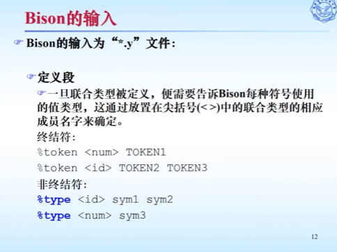

# 预习

可以使用graphviz库中的DOT语言来可视化你的AST。你可以使用graphviz中的dot命令将AST转换为图像。

## Reference
https://www.bilibili.com/video/BV1KF411h7M7/

## Flex - 快速词法分析器生成工具

Flex是一个用于生成词法分析器的工具，支持通过正则表达式来对词法单元的模式进行描述。

Flex本身也称作Flex编译器，他将输入的模式转换成一个状态转换图，并生成相应的代码（核心是yylex()函数），存放到文件lex.yy.c中。

Flex的输入（也称作Flex源程序）是后缀为.l的文件，该文件按照Flex语言进行编写，用于描述将要生成的词法分析器。

 

一个Flex函数的一般形式
 

Flex的声明部分

 

Flex的转换规则部分
yytext: 词素
可以在花括号当中输入一些print语句，这样的话识别到相应模式的时候就会打印相应日志
花括号中return的IF或者THEN是词法单元名，yylval用来保存词法单元的属性。
 

Flex的辅助函数部分
 

Flex定义的一些常用变量
 

正则表达式
 

Flex如何处理二义性
 - 匹配尽可能长的字符模式
 - 匹配在程序中更早出现的模式：else作为关键字出现更早，因此字符串会被匹配成关键字而不是后面的字符
 

## Bison - 快速语法分析器生成工具

Bison简介及工作原理
 

 

 

Bison的输入
 

 

 

 

 

 

 

 

 

 

 

 

## 语法树的导出

语法树的遍历

 

Graphviz可视化

 

 

 